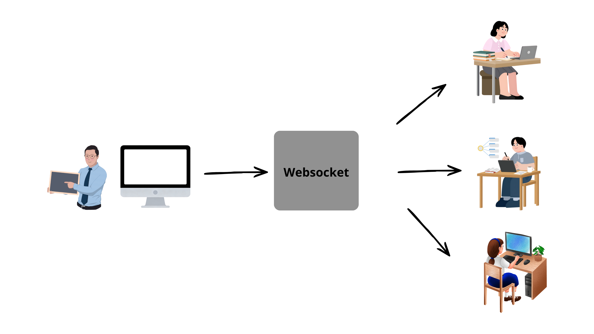

# 🚀 LibrasCode - Back-end API

O **LibrasCode Back-end** é o cérebro que faz a ponte entre o professor e os alunos. Ele é responsável por receber o texto falado pelo professor e enviá-lo, em tempo real através de sockets, para todos os alunos que estão assistindo à aula.

---

## 🛠 Tecnologias e Stack
* **Linguagem:** Python 3.x
* **Framework:** [FastAPI](https://fastapi.tiangolo.com/) (Framework moderno e assíncrono)
* **Servidor:** [Uvicorn](https://www.uvicorn.org/) (Servidor ASGI de alto desempenho)
* **Comunicação:** Protocolo WebSocket (Full-duplex para tempo real)

---

## 🏗 Arquitetura do Sistema
O back-end atua como o **Hub de Dados** da aplicação, gerenciando o ciclo de vida das conexões e a propagação de mensagens entre os clientes (estudantes e professores).

---

## 🚀 Guia de Configuração (Quick Start)

### 1. Pré-requisitos
Certifique-se de ter o [Python](https://www.python.org/) instalado em sua máquina.

### 2. Instalação
Clone o repositório e instale as dependências necessárias:
```bash
# Instalar dependências
pip install -r requirements.txt 
``` 

## 🚀 Como Rodar
1. No diretório do projeto, instale as dependências: `pip install -r requirements.txt`
2. Inicie o servidor: `uvicorn main:app --reload --port 8003`

OBS: é de suma importânia rodar nessa porta, pois é nela que o frontend da aplicação está se conectando com o webSocket para a transmissão ao Vivo da funcionalidade de  aula. 


## 🔗 Conectando ao Front-end

Este servidor está preparado para receber conexões do cliente React:

1. O endpoint WebSocket está disponível em `ws://localhost:8000/librasCodeWebsocket`.

2. Para executar o front-end, clone o repositório:

[Repositório LibrasCode-Frontend](https://github.com/rafaelalex16/LibrasCode-frontend.git)

3. Após clonar, siga as instruções descritas no README do projeto para instalação das dependências e execução da aplicação.


## 📸 Estrutura de Fluxo

O sistema funciona por meio de comunicação em tempo real entre professor, servidor e alunos. A fala do professor é capturada pelo navegador, convertida em texto utilizando reconhecimento de voz e enviada para o servidor através de WebSocket. O servidor recebe essas mensagens e as retransmite para os alunos conectados, permitindo que a transcrição seja exibida instantaneamente durante a aula.



